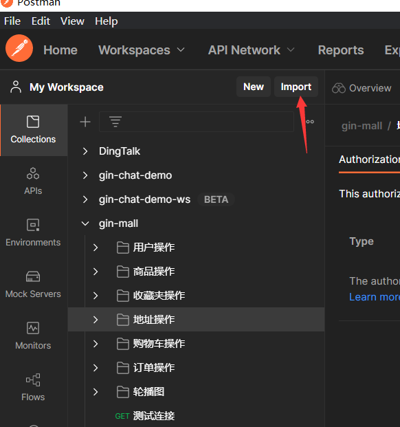
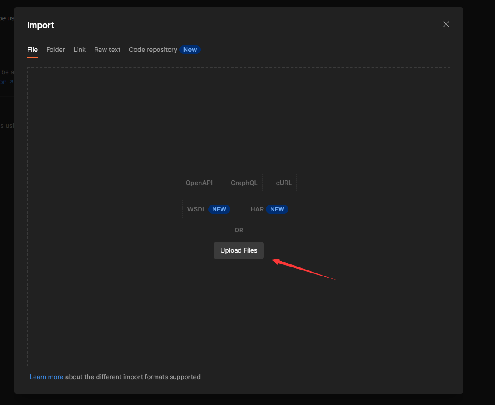
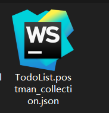
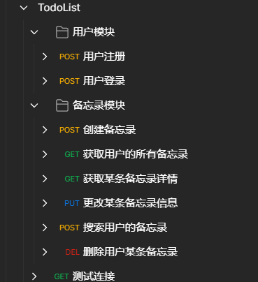

# Todo List 备忘录

**此项目使用`Gin`+`Gorm` ，基于`RESTful API`实现的一个备忘录**。

**此项目比较适合小白入门`web开发`这一方面**
# 详细教程

**注意，最新版本是v2**

B站: 
- v1版本：https://www.bilibili.com/video/BV1GT4y1R7tX 
- 重构v2版本：https://www.bilibili.com/video/BV13z4y1a7ZJ

博客: 
- v1版本：https://blog.csdn.net/weixin_45304503/article/details/120680957
- 重构v2版本：https://blog.csdn.net/weixin_45304503/article/details/130460797

**前端仓库地址：https://github.com/CocaineCong/react-todolist**


## 项目运行
### 手动执行
**本项目使用`Go Mod`管理依赖。**

将所有环境拉取启动

```shell
make env-up
```

**下载依赖**

```shell
go mod tidy
```

**运行**

```shell
go run ./cmd/main.go
```

将所有环境关闭并删除

```shell
make env-down
```

# 接口文档

[Todo List 接口文档](https://www.showdoc.cc/1510696761141710)

**密码：0000**

也可以启动项目后，直接访问 http://localhost:3000/swagger/index.html 

查看**swagger**文档

也可以选择postman文档导入

打开postman，点击导入



选择导入文件




效果




## 项目主要功能介绍

- 用户注册登录 ( jwt-go鉴权 )
- 新增/删除/修改/查询 备忘录
- 存储每条备忘录的浏览次数
- 分页功能


## 项目主要依赖：

**Golang V1.15**

- Gin
- Gorm
- mysql
- redis
- ini
- jwt-go
- logrus
- go-swagger

## 项目结构

```shell
TodoList/
├── api
├── cmd
├── conf
├── consts
├── docs
├── middleware
├── pkg
│  ├── e
│  └── util
├── routes
├── repository
│  ├── cache
│  └── db
│     ├── dao
│     └── model
├── routes
├── service
└── types
```

- api : 用于定义接口函数,也就是controller层
- cmd : 程序启动
- conf : 用于存储配置文件
- middleware : 应用中间件
- pkg/e : 封装错误码
- pkg/logging : 日志打印
- pkg/util : 工具函数
- repository: 仓库放置所有存储
- repository/cache: 放置redis缓存
- repository/db: 持久层MySQL仓库
- repository/db/dao: 对db进行操作的dao层
- repository/db/model: 定义所有持久层数据库表结构的model层
- routes : 路由逻辑处理
- service : 接口函数的实现
- types : 放置所有的定义的结构体

## 配置文件
配置文件在conf/config.ini.example中，把.example去掉，然后根据自己的情况配置就好了

**conf/config.ini**
```ini
# debug开发模式,release生产模式
[service]
AppMode = debug
HttpPort = :3000
# 运行端口号 3000端口

[redis]
RedisDb = redis
RedisAddr = 
# redis ip地址和端口号
RedisPw = 
# redis 密码
RedisDbName = 2
# redis 名字

[mysql]
Db = mysql
DbHost =
# mysql ip地址
DbPort = 
# mysql 端口号
DbUser = 
# mysql 用户名
DbPassWord = 
# mysql 密码
DbName = 
# mysql 名字
```

## 简要说明
1. `mysql`是存储主要数据
2. `redis`用来存储备忘录的浏览次数
